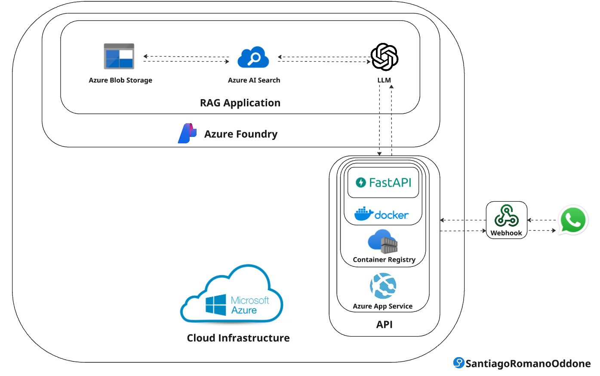

# Azure RAG Application

## Overview
This project is an end-to-end Retrieval-Augmented Generation (RAG) application fully hosted on **Azure**.  
It connects **WhatsApp** with an intelligent agent that retrieves and provides information in real time.

## Key Components
- **WhatsApp:** Entry point for user messages.  
- **Webhook:** Forwards incoming WhatsApp messages to the application API.  
- **FastAPI Application:** Core backend that processes requests and interacts with Azure services.  
- **Docker & Azure Container Registry:** Used to containerize and store the FastAPI application.  
- **Azure App Service:** Hosts the containerized FastAPI app and exposes the agent’s public endpoint.  
- **Azure AI Foundry (RAG Agent):**  
  - Uses **GPT-4** as the LLM for generating responses.  
  - Integrates with **Azure AI Search** to retrieve relevant information stored in **Azure Blob Storage**.  
- **Azure AI Search:** Performs hybrid (semantic + keyword) retrieval over indexed content.  
- **Azure Blob Storage:** Stores source documents used by the agent.  

## How It Works
1. A user sends a message on WhatsApp requesting specific information.  
2. The **webhook** captures the message and redirects it to the **FastAPI endpoint**.  
3. The **agent** retrieves the most relevant information from Azure AI Search (connected to Blob Storage).  
4. The **GPT-4 model** generates a contextualized answer using the retrieved data.  
5. The response is sent back to the user via **WhatsApp**.  
